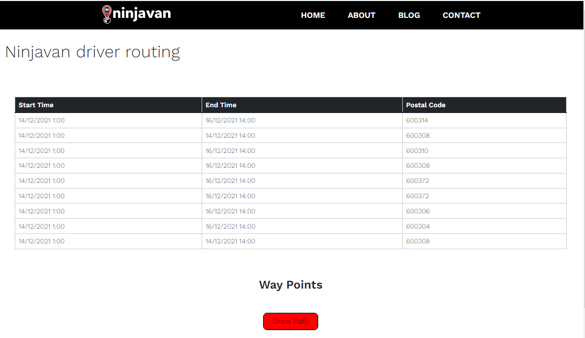
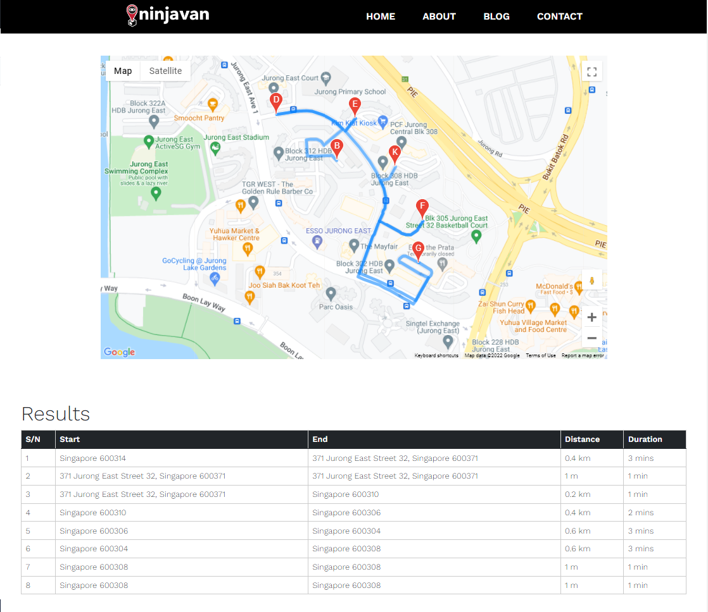

# Ninjavan driver routing by Team The Minions

* TAN TING CHER BENJAMIN (benjamintan.2020@scis.smu.edu.sg) 
* DARIEN TAN SHI FENG (darien.tan.2020@scis.smu.edu.sg) 
* LIM TSE HWEE (tsehwee.lim.2020@scis.smu.edu.sg) 
* CHEONG WEI SOON (wscheong.2020@scis.smu.edu.sg) 

# Project Overview
Our group, The Minions has decided to work on a solution for drivers, that would help ease their difficulties when delivering a parcel from one point to another. Our solution offers customising routes for last mile deliveries by letting drivers optimise their own routes. When allowing them to customise their own routes, we utlise the drivers experience as well as intuition, this enables local optimisation to be done and thus allows them to optimise their own routes easily.

# What it does
**The Minions** has coded a web application that generates the schedule of the driver. This schedule is flexible and the driver can choose where they want to go - the routes will be shown on the map to guide the driver on how to get there, with the timings and distances between each waypoint displayed in a table below. The tables can be dragged and reordered according to their preferences. This will allow drivers to fully maximise their delivery efficiency, through a simple and easily accessible interface.

# Project Demo

*Schedule which is click and drop and click the button for the route to be generated*

*Table showing the distance and duration of each trip, the same postal codes will be clustered together. Routes are shown in the map*
